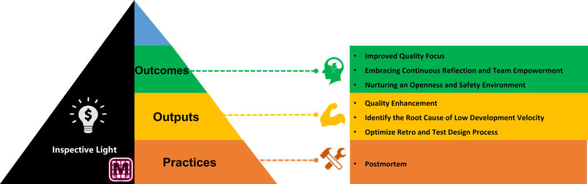
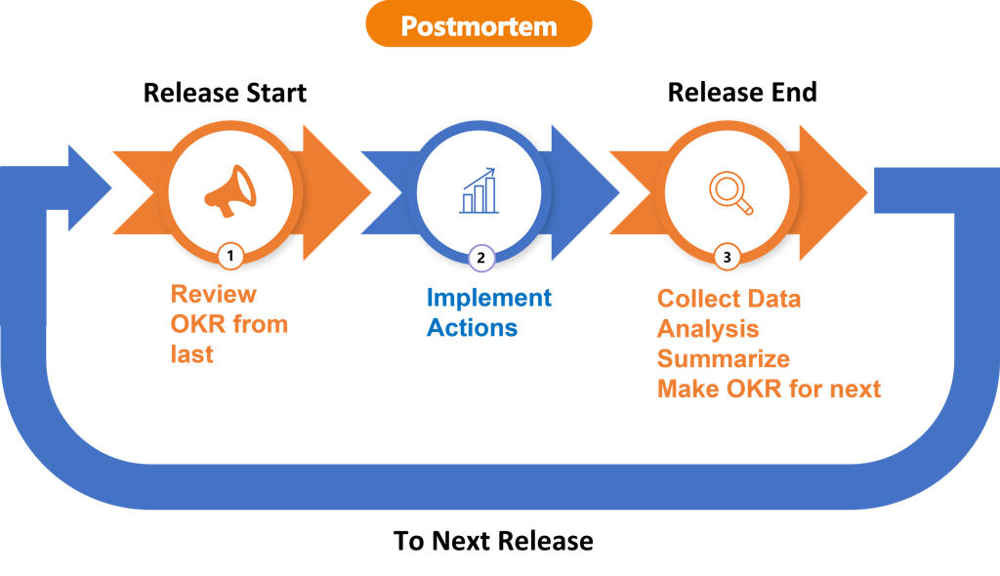
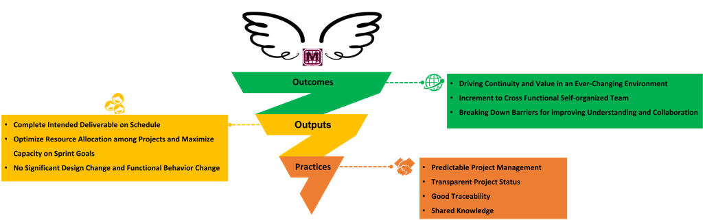

As an engineer‑turned‑Scrum‑Master from China, I’ve spent the last few years helping a cross‑functional product team navigate organisational change, technical debt and feature pressure. We didn’t always get it right, but by embracing transparency and continuous improvement we built a culture that values quality, delivers on commitments and allows everyone’s voice to be heard.

## An inspective light on quality and culture

One of the first lessons we learned was that shipping new features at all costs is a false economy. In our **Inspective Light** OKR we intentionally set objectives around quality, not feature counts. By prioritising bug fixes and regression prevention, the number of pull requests (PRs) and regression tests shrank compared with the previous release. We also saw more issues closed proactively, an indication that engineers were addressing problems before they became PRs.

Continuous retrospection and empowerment were at the heart of this. We encouraged the team to acknowledge shortcomings and seek change. Reflecting on our progress – not to apportion blame, but to learn – helped everyone accept organisational shifts and drive continual improvement. This openness fostered a safe environment where problems were surfaced early and addressed collaboratively.

The **“Inspective Light” pyramid** illustrates how this worked in practice: at the top are outcomes like improved quality focus and a safer environment; the middle shows outputs such as quality enhancement and identifying root causes; and the base emphasises practices like post‑mortem reviews. This diagram became a talking point in our retrospectives and helped new members understand why quality was non‑negotiable.

## Turning OKRs into action with post‑mortems

Objectives and Key Results (OKRs) are only useful when they trigger real work. For each key result we identified concrete actions – experiments, refactors or training sessions – that would move the metric. During sprint planning we checked whether the backlog contained these actions. In this way, **O → KR → Action** became part of our vocabulary and prevented people from confusing tasks with outcomes.

To close the loop we institutionalised post‑mortem reviews. At the end of each release we:

- Reviewed the previous release’s OKRs and progress – what worked and what didn’t.
- Implemented actions – ensured retro tasks and experiments were carried out during the release.
- Collected and analysed data – bug/PR statistics, burndown charts and velocity metrics, then summarised lessons and defined the next OKR.

This continuous loop of learning and improvement ensured we weren’t just making noise; we were systematically improving the way we worked. A typical post‑mortem would dissect our bug analysis, root‑cause findings and sprint burndowns. We discovered, for example, that SCD5 dependencies slowed us down, and that sprint retrospectives were more effective when they included epic status, focus on release OKRs and a space for “having voices”. Each insight led to actions – such as introducing quality labels to evaluate product quality or rewriting acceptance criteria checklists – and those actions fed into the next iteration’s OKRs.

## Soaring beyond barriers with transparent wings

As our team matured, we moved from “inspecting” to “soaring.” The **Transparent Wings** initiative focused on continuity, self‑organisation and collaboration. We wanted to deliver value even when priorities shifted, so we invested in predictable project management and transparency. Outcomes included:

- **Driving continuity and value** in an ever‑changing environment – by being transparent about plans and progress, we enabled other teams to adjust and continue their work.
- **Increment to a cross‑functional self‑organised team** – better planning, documentation and communication meant we could manage risks and dependencies, share knowledge and maintain a clear project status.
- **Breaking down barriers for collaboration** – stakeholders gained a comprehensive understanding of our progress, leading to seamless collaboration across groups.

The accompanying diagram captured this transformation. The green “outcomes” highlighted our ambition to drive continuity and empower the team. The yellow “outputs” listed concrete deliverables such as completing intended deliverables on schedule and optimising resource allocation. The orange “practices” reminded us of the habits that supported these goals: predictable project management, transparent status, traceability and shared knowledge.

## Delivering on promises

During the 2306 release we completed our epics on schedule. We achieved this by proactively communicating requirements and plans, providing guidance documents and demoing new functionality. We also improved resource allocation by exposing requirements, dependencies and risks so project managers could rebalance workloads. Importantly, we delivered without major design or behaviour changes. This stability allowed downstream teams to integrate our work smoothly.

## Best practices and working agreements

Beyond charts and diagrams, our success was built on habits and agreements. Some highlights include:

- **Roadmap definition** – analysing requirements to determine the minimum marketable features and then co‑creating a roadmap. Epic leaders shared dependencies and risks, every member contributed ideas and concerns, and we updated the roadmap after every sprint.
- **Epic structure for transparency** – using the epic structure view in our issue tracker improved vertical slicing and made progress, dependencies and risks visible.
- **Root‑cause labelling** – adding root‑cause labels to PRs and bugs improved our quality analysis.
- **Proactive status exposure** – we posted progress updates, risks and dependencies regularly and asked epic leaders to keep their statuses current.
- **Improved traceability and documentation** – we kept wiki pages structured and used templates for requirements, design and functional tests so anyone could understand a feature’s intent and status.
- **Feedback and retro action management** – sprint review feedback was logged in a wiki, actionable items were converted into tasks and pulled into the sprint backlog.
- **Knowledge sharing** – a well‑structured wiki hierarchy and clear communication channels made knowledge public and shared.

These practices, combined with the checklists we used for definition of ready (DoR) and definition of done (DoD), ensured that epics and user stories were thoroughly analysed before development. We evaluated dependencies, skills gaps and test designs; and we defined acceptance criteria before moving a task to ready status. Having lightweight templates for requirement specs, design docs and functional test plans gave our work consistency without bureaucratic overhead.

## Reflections and what’s next

Looking back, the biggest achievement wasn’t a particular feature or metric; it was cultivating an open, data‑driven mindset. By shining a light on quality, turning OKRs into actions and celebrating transparency, we empowered the team to own the process. Our retrospectives were no longer blame sessions but learning opportunities. Post‑mortems and root‑cause labels turned instinct into evidence. Roadmaps and epic structures made planning democratic and predictable.

There’s still plenty to improve – agile is a journey, not a destination. In future releases we will continue to refine our OKRs, automate more metrics and coach new teams on these practices. But the principles remain the same: focus on outcomes, measure what matters and foster a safe environment where everyone can contribute.

If you’re curious about how to adapt these practices to your context, feel free to reach out. Agile isn’t a silver bullet, but with the right mindset and structures, it can make your team not only deliver more but also thrive along the way.
